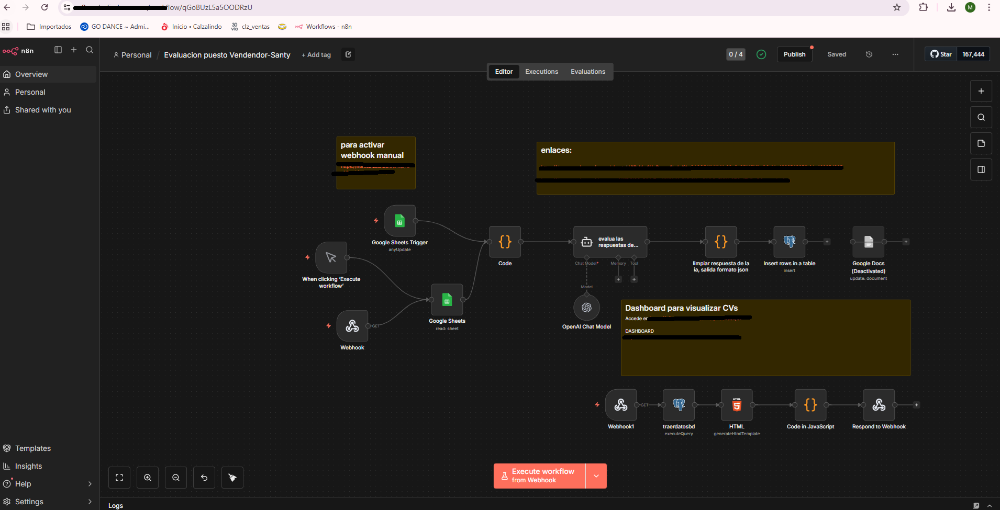
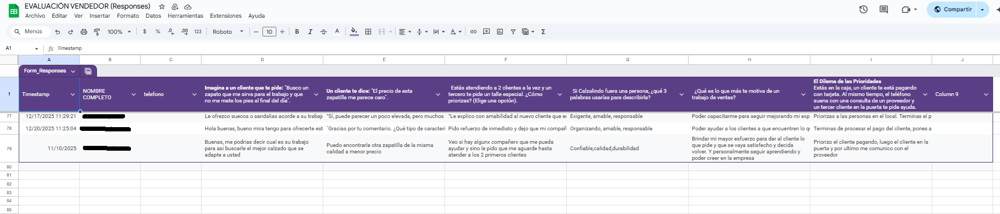
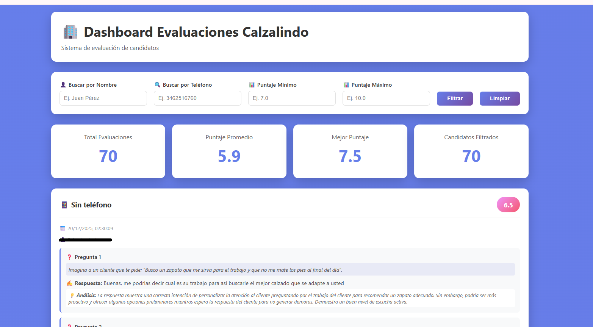

# Evaluación Automática de Candidatos – Puesto Vendedor (n8n)

## Descripción general

Esta automatización corresponde a un **workflow de n8n orientado al área de RRHH**, diseñado para **evaluar candidatos al puesto de vendedor** a partir de respuestas recolectadas en Google Forms / Google Sheets.

El flujo utiliza **IA (OpenAI vía LangChain)** para analizar las respuestas, generar un **puntaje general**, emitir un **dictamen de aptitud**, sugerir **capacitaciones** y almacenar toda la evaluación en una base de datos, además de exponer un **dashboard web** para su visualización.

Es una automatización funcional, pensada para uso interno, que centraliza evaluación, persistencia y visualización en un solo circuito.

---

## Objetivo del workflow

- Recibir respuestas de candidatos automáticamente desde Google Forms.
- Evaluar cualitativa y cuantitativamente cada postulación.
- Asignar un puntaje general numérico (1 a 10).
- Determinar si el candidato es apto o no para el puesto.
- Generar análisis individuales por respuesta.
- Recomendar capacitaciones y aspectos a potenciar.
- Persistir resultados en base de datos.
- Visualizar evaluaciones desde un dashboard web.

---

## Tecnologías utilizadas

- **n8n** (orquestador principal)
- **Google Forms / Google Sheets** (entrada de datos)
- **OpenAI (GPT-4.1-mini)** vía LangChain
- **PostgreSQL (Supabase)** para persistencia
- **HTML + CSS + JavaScript** (dashboard)
- **Webhooks HTTP** para activación y visualización

---

## Flujo general de la automatización

### 1. Ingreso de respuestas
- Nodo: `Google Sheets Trigger`
- Detecta nuevas respuestas del formulario de candidatos.
- Alternativamente puede activarse vía `Webhook` o ejecución manual.

---

### 2. Selección del último registro
- Nodo: `Code`
- Toma únicamente la última respuesta ingresada para evitar reprocesar datos históricos.

---

### 3. Evaluación con IA
- Nodo: `AI Agent`
- Rol: asistente de RRHH
- Evalúa:
  - Atención al cliente
  - Manejo de objeciones
  - Priorización
  - Actitud
  - Motivación
  - Criterio operativo
- Devuelve **exclusivamente un JSON estructurado** con:
  - Puntaje general
  - Análisis por pregunta
  - Apto / no apto
  - Comentarios
  - Capacitación recomendada

---

### 4. Normalización de salida
- Nodo: `Code`
- Función:
  - Limpia la respuesta del modelo
  - Corrige errores comunes de formato
  - Garantiza JSON válido
  - Asegura que el puntaje sea numérico

---

### 5. Persistencia en base de datos
- Nodo: `Postgres`
- Inserta:
  - Datos del candidato
  - Respuestas originales
  - Análisis de IA
  - Puntaje final
- Tabla principal: `evaluacion_preguntas`

---

### 6. Dashboard de visualización

- Nodo: `Postgres (SELECT)`
- Recupera evaluaciones históricas.
- Nodo: `HTML`
  - Renderiza un dashboard web con:
    - Filtros por nombre, teléfono y puntaje
    - Puntaje promedio
    - Mejor puntaje
    - Listado completo de evaluaciones
- Expuesto vía `Webhook /dashboard`

---

### 7. Endpoints disponibles

- Activar revisión manual: /webhook/activarrevision

### 8.- Dashboard de evaluaciones: /webhook/dashboard

---

## Estructura de salida (resumen)

Cada evaluación incluye:

- Nombre del candidato
- Teléfono
- Puntaje general (numérico)
- Análisis detallado por pregunta
- Dictamen de aptitud
- Comentarios generales
- Capacitación sugerida
- Fecha de evaluación

---

## Limitaciones conocidas

- Prompt extenso y hardcodeado dentro del nodo.
- Lógica concentrada en pocos nodos.
- Sin control de duplicados por candidato.
- Sin versionado de evaluaciones.
- Sin métricas de performance del modelo.
- No hay sistema de scoring configurable.
- Arquitectura no pensada para alto volumen.

---

## Valor del proyecto

- Automatiza completamente un proceso de evaluación inicial.
- Reduce carga manual del área de RRHH.
- Estandariza criterios de evaluación.
- Integra IA de forma práctica y medible.
- Combina backend + frontend en un solo flujo.

---

## Posibles mejoras futuras

- Separar prompts por versión.
- Parametrizar criterios de evaluación.
- Agregar ranking automático de candidatos.
- Integrar notificaciones (email / Slack).
- Mejorar control de errores.
- Implementar autenticación en el dashboard.
- Agregar historial por candidato.

---

## Estado actual

🟢 Funcional  
🟡 Uso interno  
🔵 En evolución  

---

**Autor:** Santiago Perez Kay  
**Contexto:** Automatización de RRHH con IA desarrollada en n8n

